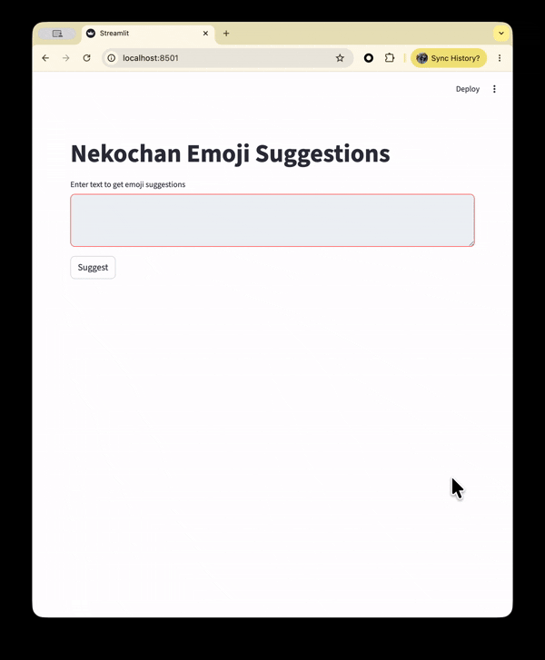

# nekochan-suggest

> For Japanese documentation, see [README.ja.md](README.ja.md).

A CLI / GUI tool that suggests nekochan emoji filenames for a given text, using local LLM annotation and semantic search.

## Overview

`nekochan-suggest` takes a piece of text and returns the most relevant [nekochan](https://note.com/shikamatsu/n/nd217dc0617db) emoji filenames, ranked by semantic similarity. Annotations are generated locally via [Ollama](https://ollama.com/) and embedding-based search is performed with [sentence-transformers](https://www.sbert.net/).



## Installation

Requires [uv](https://docs.astral.sh/uv/).

```bash
# Install with development dependencies
uv sync
```

To use the GUI (Streamlit):

```bash
uv sync --extra gui
```

## Usage

### CLI

```bash
# Suggest emojis for a text
nekochan-suggest "I'm so sleepy today"

# Specify the number of suggestions (default: 3)
nekochan-suggest --count 5 "I'm so sleepy today"

# Output results in JSON format
nekochan-suggest --json "I'm so sleepy today"

# Build (or rebuild) the annotation index
nekochan-suggest build-annotations

# Preview the first 3 annotations without saving (dry run)
nekochan-suggest build-annotations --dry-run

# Set HTTP timeout for Ollama requests
nekochan-suggest build-annotations --timeout 60

# Show help
nekochan-suggest --help
nekochan-suggest build-annotations --help
```

### GUI

```bash
nekochan-suggest-ui
```

### Prerequisites for `build-annotations`

1. Install and start [Ollama](https://ollama.com/):
   ```bash
   ollama serve
   ollama pull gemma4:e4b
   ```
2. Run the annotation build (this may take a while on first run):
   ```bash
   nekochan-suggest build-annotations
   ```

Annotations are stored at `~/.local/share/nekochan-suggest/annotations.json`.  
To regenerate a specific emoji, remove its entry from the file and re-run `build-annotations`.

## Development

```bash
# Linting
make lint

# Formatting
make format

# Type checking
make typecheck

# Tests
make test

# All checks (CI equivalent)
make check
```

## License

See [LICENSE](LICENSE).

